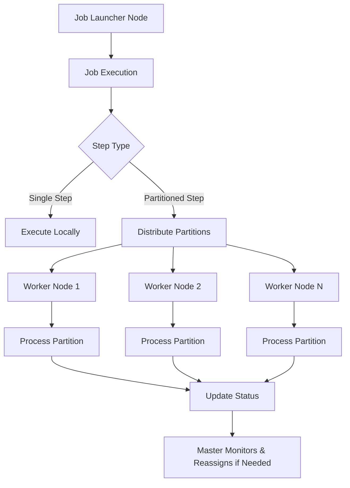
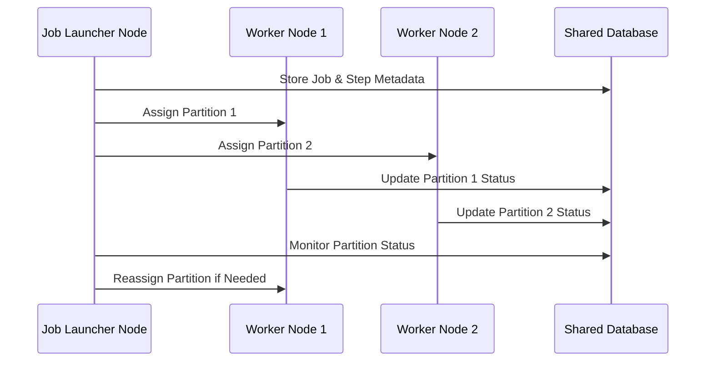

# Spring Batch Database-Backed Clustered Partitioning

A lightweight, fail-safe, database-driven distributed partitioning framework built on top of Spring Batch. This system enables clustered execution of batch jobs using a shared database for coordination, allowing any node to assume the role of master if another node goes down.

## Features
<ul>
  <li><strong>Custom PartitionHandler</strong> with database-backed partition distribution</li>
  <li><strong>Leader Election via Heartbeat Table</strong></li>
  <li><strong>Automatic Failover</strong> if a node dies (If the task/sub-task is re-runnable)</li>
  <li><strong>Dynamic Partition Assignment</strong> (Choice of strategies, such as <code>FIXED_NODE</code>, <code>SCALE_UP</code>, <code>ROUND_ROBIN</code> or you can customize it)</li>
  <li><strong>No external brokers (like Kafka or RabbitMQ)</strong></li>
  <li><strong>Built-in resilience and horizontal scalability</strong></li>
</ul>


## Use Cases
<ul>
  <li>High-throughput batch jobs in clustered environments</li>
  <li>Jobs needing fault tolerance and automatic node recovery</li>
  <li>Cloud-native workloads using database metadata for coordination</li>
</ul>

## Architecture 



## Sequence diagram




## Table Schema

The following tables are required:

<code>BATCH_PARTITIONS</code>

```sql
CREATE TABLE BATCH_PARTITIONS (
    step_execution_id BIGINT PRIMARY KEY,
    job_execution_id BIGINT,
    partition_key VARCHAR(255),
    status VARCHAR(50),
    assigned_node VARCHAR(255),
    last_updated TIMESTAMP
);
```

<code>BATCH_JOB_COORDINATION</code>
```sql
CREATE TABLE BATCH_JOB_COORDINATION (
    job_instance_id BIGINT PRIMARY KEY,
    leader_id VARCHAR(255),
    last_heartbeat TIMESTAMP
);
```

## Components

<code>ClusterAwarePartitionHandler</code>: Writes partition metadata to DB.

<code>LeaderElectionScheduler</code>: Elects leader and checks partition completion.

<code>PartitionWorkerTasksRunner</code>: Claims available partitions and executes them.

<code>ClusterAwarePartitioner</code>: Delegates the partitions creation logic to the caller and perists them for execution across nodes.

## Failover Logic
<ul>
  <li>Nodes periodically claim leadership for a job instance.</li>
  <li>If current leader hasn't sent a heartbeat in 30 seconds (configurable), another node takes over.</li>
  <li>All partition status is stored in the database to ensure consistency.</li>
</ul>

## How to Run
<ol>
  <li>Set up the database schema.</li>
  <li>Start multiple Spring Boot JVMs with this application.</li>
  <li>Launch the partitioned job.</li>
  <li>One JVM will take leadership and coordinate partitioning.</li>
  <li>Other nodes will pick up work based on DB state.</li>
</ol>

## License

Licensed under the Apache License, Version 2.0.

## Author
janardhan.chejarla@googlemail.com
