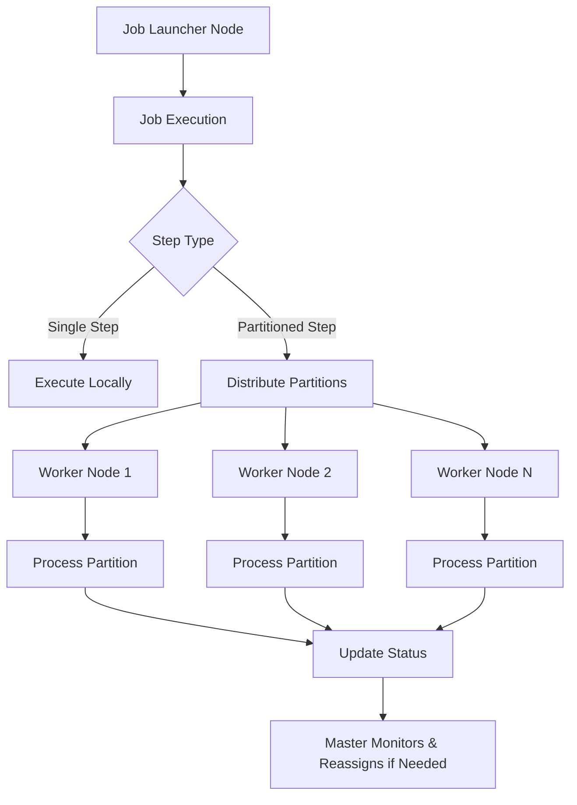
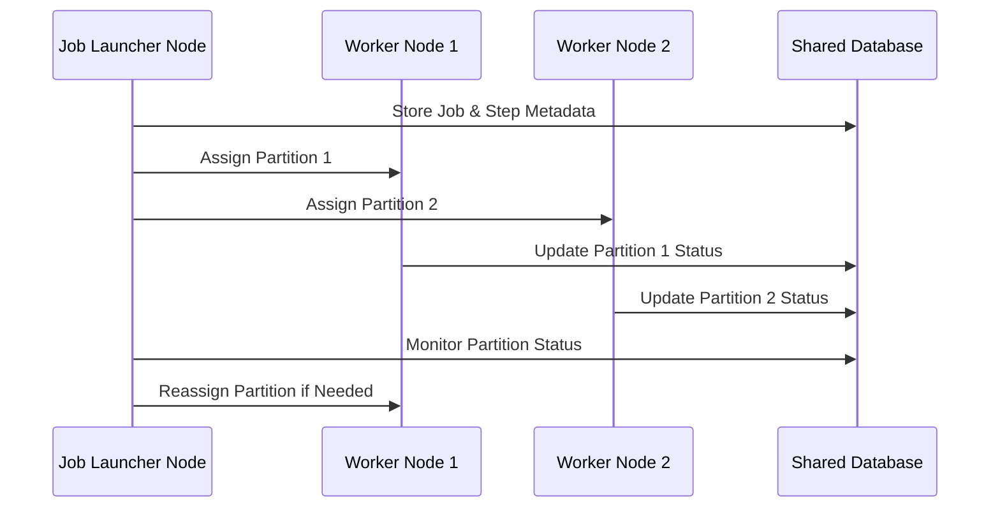

# Spring Batch Database Cluster Partitioning

[](https://opensource.org/licenses/Apache-2.0)
[](https://github.com/jchejarla/spring-batch-db-cluster-partitioning/actions/workflows/maven.yml)
[](https://search.maven.org/artifact/io.github.jchejarla/spring-batch-db-cluster-core)

## 🚀 Overview

This project provides a novel solution for distributed partitioning in Spring Batch, enabling scalable and fault-tolerant execution of batch jobs across multiple JVM instances (nodes). Unlike traditional Spring Batch remote partitioning methods that rely on external messaging systems (e.g., Kafka, RabbitMQ) or complex orchestrators, this solution leverages a **shared relational database** for all cluster coordination, dynamic task assignment, explicit state tracking, and reliable fault detection and recovery.

This approach simplifies the architecture, provides real-time visibility into job progress, and ensures robust task re-assignment upon node failures, all while minimizing changes to existing Spring Batch application logic.

The core principles of this project is to know **number of available nodes** upfront so that the efficient tasks partitioning and distribution strategy can be determined at runtime, and **facilitate easy failover** in the event of any cluster node is not responding.

## ✨ Key Features

* **Database-Driven Coordination:** Utilizes a common relational database (e.g., PostgreSQL, Oracle, MySQL) as the central hub for cluster state management.
* **Dynamic Node Awareness:** Master nodes discover and assign partitions to active worker nodes in real-time by querying the database.
* **Flexible Partitioning Strategies:**
    * **Round-Robin:** Evenly distributes partitions across available nodes.
    * **Fixed Node Count:** Assigns partitions to a specified number of nodes.
* **Explicit Task State Tracking:** Every partition's lifecycle (PENDING, CLAIMED, COMPLETED, FAILED) is transactionally recorded, offering unparalleled visibility.
* **Robust Fault Tolerance:**
    * **Node Heartbeats:** Worker nodes periodically update their liveness, enabling master nodes to detect unresponsive instances.
    * **Configurable Task Re-assignment:** Uncompleted tasks from failed nodes can be automatically re-assigned to healthy nodes, ensuring job completion.
* **Simplified Architecture:** Reduces operational overhead by eliminating the need for complex message queues or dedicated cluster management tools.
* **Customizable Callbacks:** Provides interfaces for custom logic upon overall job success or failure.

## 🛠️ How it Works

1.  **Node Registration:** Each Spring Batch instance (master and worker) registers itself in the `BATCH_NODES` table upon startup and sends periodic heartbeats.
2.  **Partitioning (Master Node):**
    * A custom `ClusterAwarePartitioner` queries the `BATCH_NODES` table to identify active workers.
    * It then splits the job's workload into `ExecutionContext` partitions.
    * Based on a chosen `PartitionStrategy` (e.g., Round-Robin), it assigns these partitions to active worker nodes and records them in the `BATCH_PARTITIONS` table with a 'PENDING' status.
3.  **Task Execution (Worker Nodes):**
    * Each `PartitionWorkerTasksRunner` on a worker node continuously polls the `BATCH_PARTITIONS` table for tasks assigned to it.
    * Upon picking up a task, it immediately updates its status to 'CLAIMED' transactionally.
    * The worker then executes the assigned Spring Batch `Step`.
    * Throughout execution, and upon completion/failure, the worker updates the task's status in `BATCH_PARTITIONS` and the Spring Batch `JobRepository`.
4.  **Fault Tolerance:**
    * If a worker node fails, its heartbeats stop. After a configurable timeout, the master node (or another designated process) marks the node as `UNREACHABLE` in `BATCH_NODES` and eventually removes it.
    * Any 'CLAIMED' or 'PENDING' partitions associated with the failed node that are marked `is_transferable` are identified and made available for re-assignment to other active nodes, ensuring the job completes.
5.  **Aggregation:** The `ClusterAwareAggregator` collects results from all partitions, updating the master job's status and invoking success/failure callbacks.

## Architecture 



## Sequence diagram


## 📚 Featured In
* [TechRxiv Preprint](https://www.techrxiv.org/users/944717/articles/1314759-spring-batch-database-backed-clustered-partitioning-a-lightweight-coordination-framework-for-distributed-job-execution) (76+ views, 20+ downloads)
* [Dev.to Article](https://dev.to/jchejarla/spring-batch-clustering-with-zero-messaging-introducing-spring-batch-db-cluster-partitioning-39p4) (138+ views)
* [Medium Article](https://medium.com/@jchejarla/how-i-built-a-fault-tolerant-spring-batch-clustering-framework-with-just-a-database-10fca611aff4)

## 🔍 Actuator Endpoints

| Endpoint                            | Description                                  |
|-------------------------------------|----------------------------------------------|
| `/actuator/health`                 | Shows cluster-aware health status            |
| `/actuator/batch-cluster`         | Cluster overview of node executions         |
| `/actuator/batch-cluster/{nodeId}`| Details of a specific node        |


## 📦 Getting Started

### Prerequisites

* Java 17+
* Maven 3.x or Gradle 7.x+
* A relational database (e.g., PostgreSQL, MySQL, Oracle, H2 for development)

### Installation (as a Maven/Gradle dependency)

Add the following to your `pom.xml` (for Maven):

```xml
<dependency>
    <groupId>io.github.jchejarla</groupId>
    <artifactId>spring-batch-db-cluster-core</artifactId>
    <version>2.0.0</version>
</dependency>
```
If you are using a SNAPSHOT version of the jar (snapshot version is not an official release, this is just for testing purpose), then add below snapshot repository URL into pom.xml

```xml
    <repositories>
        <repository>
            <id>central-snapshots</id>
            <url>https://central.sonatype.com/repository/maven-snapshots/</url>
            <snapshots><enabled>true</enabled></snapshots>
            <releases><enabled>false</enabled></releases>
        </repository>
    </repositories>
```

Or for Gradle:

```gradle
implementation 'io.github.jchejarla:spring-batch-db-cluster-core:2.0.0' // Use the latest version
```
> **_NOTE:_** The artifact has been deployed to Maven Central for direct consumption. For local development, you might need to build and install it to your local Maven repository (<code>mvn clean install</code>).

### Database Setup

The solution requires three new tables in your Spring Batch schema. SQL scripts for PostgreSQL, Oracle, MySQL, and H2 will be provided in the <code>spring-batch-db-cluster-core/src/main/resources/schema.schema-*.sql</code> directory.

### PostgreSQL Example Schema:

```sql
-- Table: BATCH_NODES - maintains cluster nodes heartbeat
CREATE TABLE BATCH_NODES (
    NODE_ID VARCHAR(200) NOT NULL PRIMARY KEY,
    CREATED_TIME TIMESTAMP NOT NULL,
    LAST_UPDATED_TIME TIMESTAMP NOT NULL,
    STATUS VARCHAR(20) NOT NULL, -- Indicates node status (e.g., ACTIVE, UNREACHABLE)
    HOST_IDENTIFIER VARCHAR(200),
    CURRENT_LOAD BIGINT NOT NULL DEFAULT 0
);

-- Table: BATCH_JOB_COORDINATION - Job coordination
CREATE TABLE BATCH_JOB_COORDINATION (
    JOB_EXECUTION_ID BIGINT PRIMARY KEY,
    MASTER_NODE_ID VARCHAR(200) NOT NULL,
    MASTER_STEP_EXECUTION_ID BIGINT NOT NULL,
    MASTER_STEP_NAME VARCHAR(100) NOT NULL,
    STATUS VARCHAR(20) NOT NULL,
    CREATED_TIME TIMESTAMP NOT NULL,
    LAST_UPDATED TIMESTAMP NOT NULL,
    constraint JOB_COORD_FK FOREIGN KEY (JOB_EXECUTION_ID) REFERENCES BATCH_JOB_EXECUTION(JOB_EXECUTION_ID)
);

-- Table: BATCH_PARTITIONS - Partition tracking
CREATE TABLE BATCH_PARTITIONS (
    step_execution_id BIGINT PRIMARY KEY,
    job_execution_id BIGINT NOT NULL,
    partition_key VARCHAR(100) NOT NULL,
    assigned_node VARCHAR(100),
    status VARCHAR(20) NOT NULL CHECK (status IN ('PENDING', 'CLAIMED', 'COMPLETED', 'FAILED')),
    last_updated TIMESTAMP DEFAULT CURRENT_TIMESTAMP,
    master_step_execution_id BIGINT NOT NULL,
    is_transferable SMALLINT DEFAULT 0,
    CHECK (is_transferable IN (0, 1)),
    CONSTRAINT BAT_PART_FK
        FOREIGN KEY (step_execution_id)
        REFERENCES BATCH_STEP_EXECUTION(step_execution_id)
        ON DELETE CASCADE
);
```

### Configuration

Enable the cluster partitioning by adding the following to your <code>application.properties</code> (or <code>application.yml</code>):

```properties
# Enable the cluster partitioning feature
spring.batch.cluster.enabled=true

# Unique identifier for this node instance
spring.batch.cluster.node-id=${HOSTNAME:my-batch-node-01}

# How often this node sends a heartbeat to the database (in milliseconds)
spring.batch.cluster.heartbeat-interval=3000 # 3 seconds

# How often worker nodes poll for new tasks (in milliseconds)
spring.batch.cluster.task-polling-interval=1000 # 1 second

# Time in milliseconds after which a node is considered unreachable if no heartbeat is received
spring.batch.cluster.unreachable-node-threshold=15000 # 15 seconds

# Time in milliseconds after which an unreachable node's entry is removed from BATCH_NODES
spring.batch.cluster.node-cleanup-threshold=60000 # 60 seconds (after becoming unreachable)
```
### Usage
1. Define your <code>ClusterAwarePartitioner</code>: Extend the <code>ClusterAwarePartitioner</code> abstract class.

```java
@Configuration
public class MyJobPartitioner extends ClusterAwarePartitioner {

    @Override
    public List<ExecutionContext> splitIntoChunksForDistribution(int availableNodeCount) {
        // Example: Create 10 partitions, distributing across available nodes
        List<ExecutionContext> contexts = new ArrayList<>();
        for (int i = 0; i < 10; i++) {
            ExecutionContext context = new ExecutionContext();
            context.putLong("startRange", i * 100000L);
            context.putLong("endRange", (i + 1) * 100000L - 1);
            contexts.add(context);
        }
        return contexts;
    }

    @Override
    public PartitionTransferableProp arePartitionsTransferableWhenNodeFailed() {
        // Set to YES if partitions can be re-assigned to other nodes on failure
        return PartitionTransferableProp.YES;
    }

    @Override
    public PartitionBuilder buildPartitionStrategy() {
        // Example: Use Round-Robin strategy
        return PartitionBuilder.builder().partitioningMode(PartitioningMode.ROUND_ROBIN).build();

        // Or, Fixed Node Count:
        // return PartitionBuilder.builder().partitioningMode(PartitioningMode.FIXED_NODE_COUNT).fixedNodeCount(3).build();

        // Or, Scale-Up (similar to Round-Robin but explicitly named for dynamic scaling intent):
        // return PartitionBuilder.builder().partitioningMode(PartitioningMode.SCALE_UP).build();
    }
}
```

2. Configure your partitioned step: Use your custom <code>ClusterAwarePartitioner</code> and a Step (e.g., a <code>TaskletStep</code> or <code>ItemReader/Writer</code> based step) that will be executed by each partition.

```java
@Configuration
public class MyJobConfig {

    @Autowired
    private JobRepository jobRepository;
    @Autowired
    private PlatformTransactionManager transactionManager;
    @Autowired
    private TaskExecutor taskExecutor; // For worker threads
    @Autowired
    private MyJobPartitioner myJobPartitioner; // Your custom partitioner
    @Autowired
    private ClusterAwareAggregator clusterAwareAggregator; // Provided by the library

    @Bean
    public Step partitionedWorkerStep() {
        return new StepBuilder("partitionedWorkerStep", jobRepository)
            .tasklet((contribution, chunkContext) -> {
                // This is the logic executed by each partition
                ExecutionContext stepContext = chunkContext.getStepContext().getStepExecution().getExecutionContext();
                Long startRange = stepContext.getLong("startRange");
                Long endRange = stepContext.getLong("endRange");
                String nodeId = stepContext.getString(ClusterPartitioningConstants.CLUSTER_NODE_IDENTIFIER);
                Boolean isTransferable = stepContext.getBoolean(ClusterPartitioningConstants.IS_TRANSFERABLE_IDENTIFIER);

                System.out.println(String.format("Node %s processing range %d to %d. IsTransferable: %s",
                        nodeId, startRange, endRange, isTransferable));

                // Simulate work
                long sum = 0;
                for (long i = startRange; i <= endRange; i++) {
                    sum += i;
                }
                System.out.println(String.format("Node %s finished range. Sum: %d", nodeId, sum));
                return RepeatStatus.FINISHED;
            }, transactionManager)
            .build();
    }

    @Bean
    public Step masterStep(JobExplorer jobExplorer) {
        return new StepBuilder("masterStep", jobRepository)
            .partitioner("partitionedWorkerStep", myJobPartitioner)
            .step(partitionedWorkerStep()) // The step to be executed by workers
            .aggregator(clusterAwareAggregator) // Optional: For custom success/failure callbacks
            .taskExecutor(taskExecutor) // Local task executor for master coordination, or simple direct call for small workloads
            .build();
    }

    @Bean
    public Job myPartitionedJob(Step masterStep) {
        return new JobBuilder("myPartitionedJob", jobRepository)
            .start(masterStep)
            .build();
    }

    // Example of a custom callback for aggregation
    @Bean
    public ClusterAwareAggregatorCallback myJobCompletionCallback() {
        return new ClusterAwareAggregatorCallback() {
            @Override
            public void onSuccess(Collection<StepExecution> executions) {
                System.out.println("Partitioned Job Completed Successfully!");
                executions.forEach(se -> System.out.println("  Partition " + se.getStepName() + " on node " + se.getExecutionContext().getString(ClusterPartitioningConstants.CLUSTER_NODE_IDENTIFIER) + ": " + se.getStatus()));
            }

            @Override
            public void onFailure(Collection<StepExecution> executions) {
                System.err.println("Partitioned Job FAILED!");
                executions.forEach(se -> System.err.println("  Partition " + se.getStepName() + " on node " + se.getExecutionContext().getString(ClusterPartitioningConstants.CLUSTER_NODE_IDENTIFIER) + ": " + se.getStatus() + " (" + se.getExitStatus().getExitDescription() + ")"));
            }
        };
    }
}
```
3. Run Multiple Instances: Start multiple instances of your Spring Boot application, each configured with a unique <code>spring.batch.cluster.node-id</code>. One instance will act as the master (initiating the job), and others will automatically register as workers.

### 📈 Performance and Scalability

This solution enables true horizontal scalability by distributing batch workloads across distinct physical or virtual machines. Performance benchmarks demonstrate significant reductions in job execution time as more worker nodes are added, effectively leveraging distributed computing resources.

### 🛡️ Fault Tolerance

The database-centric approach provides robust fault tolerance. In the event of a worker node failure, its assigned tasks (if marked as transferable) are identified via the database and re-assigned to other active nodes, ensuring job completion without manual intervention or data loss.

### 🤝 Contributing

Contributions are welcome! Please feel free to open issues, submit pull requests, or suggest improvements.

### 📄 License
This project is licensed under the Apache 2.0 License - see the LICENSE file for details.

### 📧 Contact
Janardhan Chejarla - janardhan.chejarla@googlemail.com


