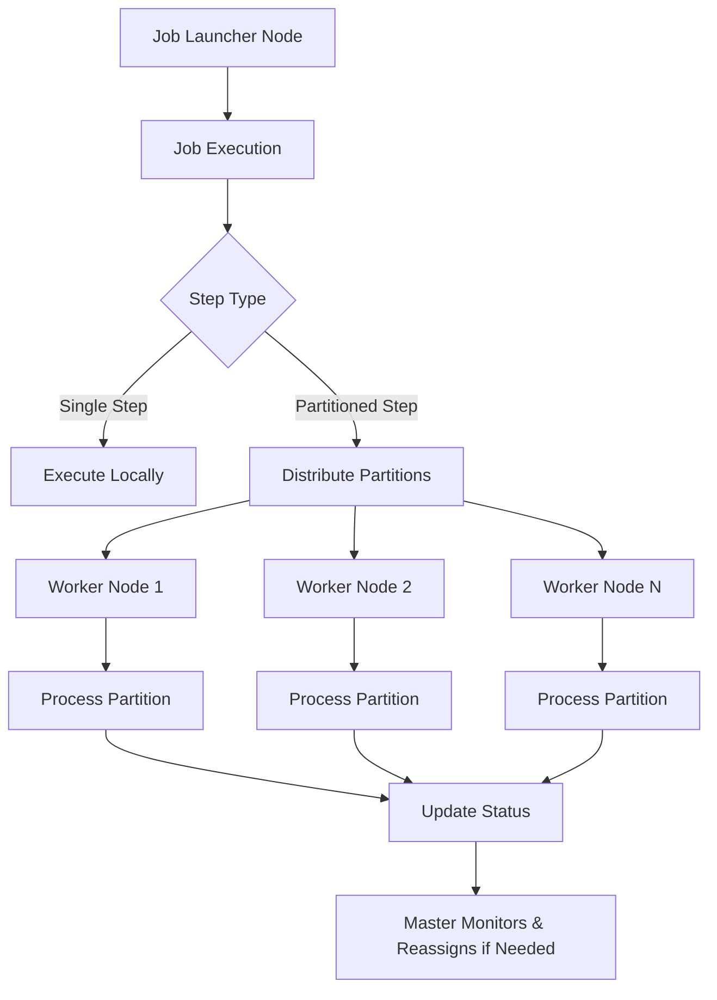
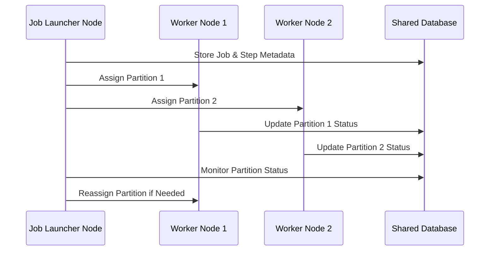

# Spring Batch Database-Backed Clustered Partitioning

A lightweight, fail-safe, database-driven distributed partitioning framework built on top of Spring Batch. This system enables clustered execution of batch jobs using a shared database for coordination, allowing any node to assume take the role of executing the task if another node goes down (If the task is marked as re-assignable).


## ✨ Features

- **Database-Backed Partition Coordination**: Utilizes a shared database to manage partition assignments and job coordination.
- **Decentralized Master Node Election Per Job**: Node that launches the Job acts as master controller for that Job.
- **Automatic Failover**: Seamlessly reassigns tasks if a node becomes unresponsive, ensuring high availability.
- **Dynamic Partition Assignment**: Supports real-time partition distribution based on node availability, load and partitioning stragetgy (<code>FIXED_NODE_COUNT</code>, <code>SCALE_UP</code>, and <code>ROUND_ROBIN</code>).
- **Cluster-Aware Aggregation**: Provides `ClusterAwareAggregator` and `ClusterAwareAggregatorCallback` interfaces for custom execution context handling post task completion.

## 🏗️ Modules

### `clustering-core`

Contains the core implementation for:

- Custom `PartitionHandler` with database-backed partition distribution.
- Custom 'ClusterAwarePartitioner' which can be customized with partition strategy.
- Leader election and heartbeat mechanisms.
- Interfaces for cluster-aware aggregation.
- Handling of failover logic.

### `examples`

Demonstrates the usage of `clustering-core` with sample jobs, showcasing:

- Configuration of partitioned steps.
- Implementation of custom partitioner
- Implementation of custom aggregators.

## 🗄️ Supported Databases

- **MySQL**
- **PostgreSQL**
- **Oracle**
- **H2** (Recommended for testing purposes only)

## 🚀 Getting Started

### Prerequisites

- Java 21 or higher
- Maven 3.6 or higher
- A supported relational database

### Build and Run (Locally)

1. Clone the repository:

   ```bash
   git clone https://github.com/jchejarla/spring-batch-db-cluster-partitioning.git
   cd spring-batch-db-cluster-partitioning
2. Build the project:

```cmd
    mvn clean install
```
3. Navigate to the <code>examples</code> module and run a sample job:

```cmd
    cd examples 
    mvn spring-boot:run
```
4. Invoke the REST end point to start the job (you can have multiple instances of App running for testing multi node setup)
<code>http://localhost:8080/api/v1/startjob</code>

5. Play around customizing partitioning logic in <code>examples.dev.jchejarla.springbatch.clustering.simplejob.SimpleJobConfig#partitioner</code>

## Architecture 



## Sequence diagram



## Components

<code>ClusterAwarePartitionHandler</code>: Writes partition metadata to DB.

<code>PartitionedWorkerNodeTasksRunner</code>: Claims available partitions and executes them.

<code>ClusterAwarePartitioner</code>: Delegates the partitions creation logic to the caller and perists them for execution across nodes.

<code>ClusterAwareAggregator</code>: Cluster aware aggregator, that can be used in <code>Step</code> building logic to be called when all tasks completed.

<code>ClusterAwareAggregatorCallback</code>: A callback interface to be registered with <code>ClusterAwareAggregator</code>, when using aggregator this interface gets called to delegate the final aggregation logic.

## Failover Logic
<ul>
  <li>Nodes periodically claim leadership for a Task instance in case if it detects the node that currently claimed is no longer healthy.</li>
  <li>If current leader hasn't sent a heartbeat in 30 seconds (configurable), another node takes over.</li>
  <li>All partition status is stored in the database to ensure consistency.</li>
</ul>


## License

Licensed under the Apache License, Version 2.0.

## Author
janardhan.chejarla@googlemail.com
