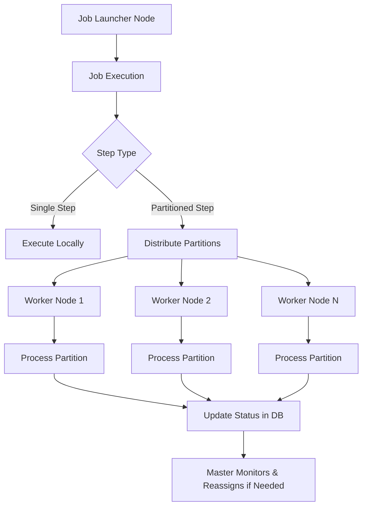

# Spring Batch Database Cluster Partitioning

[](https://opensource.org/licenses/Apache-2.0)
[](https://github.com/jchejarla/spring-batch-db-cluster-partitioning/actions/workflows/maven.yml)
[](https://search.maven.org/artifact/io.github.jchejarla/spring-batch-db-cluster-core)
[](https://doi.org/10.21105/joss.09460)
[](https://jchejarla.github.io/spring-batch-db-cluster-partitioning/)

**Database-coordinated distributed partitioning for Spring Batch.** Run partitioned batch jobs across
many JVM nodes — scalable and fault-tolerant — with all cluster coordination handled through the
relational database you already operate. No message broker, no coordination service, nothing extra to
deploy or monitor.

📖 **[Documentation site →](https://jchejarla.github.io/spring-batch-db-cluster-partitioning/)**

---

## Why

Spring Batch's standard remote partitioning dispatches partitions over a message broker as a
fire-and-forget channel: the master can't tell how many workers are alive before it partitions, and once
a partition is dispatched there's no built-in way to detect a worker that died after receiving it. Those
are coordination concerns a broker was never meant to address.

This extension adds that missing layer — proactive node awareness, transactional partition lifecycle
tracking, and heartbeat-based failover — using the database Spring Batch already requires. You gain the
coordination the broker never provided, *and* you drop the broker. (Spring Batch's own remote
partitioning already needs a shared database for the job repository; this reuses it and removes the
broker on top — see the [FAQ](docs/faq.md).)

## Key features

* **Decentralized master** — the node that launches a job is the master for that execution; no elected coordinator to run or lose.
* **Capacity-aware partitioning** — the master queries the live node count *before* splitting and passes it to your partitioner, so work is sized to the cluster that actually exists.
* **Pluggable assignment** — round-robin, fixed-node-count, or load-aware least-loaded.
* **Transactional partition lifecycle** — every partition's `PENDING → CLAIMED → COMPLETED / FAILED` transition is recorded, so nothing is double-run or lost.
* **Two-phase heartbeat failover** — a silent node is marked unreachable, then removed, and its *transferable* partitions are reassigned to healthy nodes.
* **Job-centric observability** — actuator endpoints and a query service expose live node and partition state.
* **Seven databases** — PostgreSQL, MySQL, MariaDB, Oracle, SQL Server, Db2, and H2.
* **No extra infrastructure** — all coordination state lives in your existing database, queryable with ordinary SQL.

## How it works


```mermaid
graph TD
    A[Job Launcher Node] --> B[Job Execution]
    B --> C{Step Type}
    C -->|Single Step| D[Execute Locally]
    C -->|Partitioned Step| E[Distribute Partitions]
    E --> F[Worker Node 1]
    E --> G[Worker Node 2]
    E --> H[Worker Node N]
    F --> I[Process Partition]
    G --> J[Process Partition]
    H --> K[Process Partition]
    I --> L[Update Status in DB]
    J --> L
    K --> L
    L --> M[Master Monitors & Reassigns if Needed]
```

1. **Register** — each node inserts itself into `BATCH_NODES` and heartbeats.
2. **Partition (master)** — queries live nodes, your `ClusterAwarePartitioner` splits work sized to that count, and partitions are written `PENDING` to `BATCH_PARTITIONS`.
3. **Claim & execute (workers)** — every node polls for partitions assigned to it, claims them transactionally (`CLAIMED`), and runs the Spring Batch step.
4. **Recover** — if a node's heartbeat stops it is marked unreachable and removed, and its transferable partitions are reassigned.
5. **Aggregate** — the master collects the results and finalizes the job.

For the full design rationale, fault-tolerance model, and a comparison with related approaches, see the **[Design doc](docs/DESIGN.md)**.

## Documentation

| Page | What's there |
|---|---|
| **[Installation](docs/installation.md)** | Add the dependency; create the Spring Batch + cluster schema |
| **[Usage guide](docs/guide.md)** | Write a `ClusterAwarePartitioner` and wire a partitioned job |
| **[Configuration](docs/configuration.md)** | Every `spring.batch.cluster.*` property, with defaults |
| **[Observability](docs/Observability.md)** | Actuator endpoints, example responses, `BatchClusterQueryService` |
| **[Security](docs/security.md)** | Trust model, least-privilege DB, actuator hardening |
| **[Design](docs/DESIGN.md)** | How coordination works; the fault-tolerance model; related work |
| **[Migration 2.x → 3.0](docs/migration.md)** | Upgrading to Spring Boot 4 / Spring Batch 6 / Java 21 |
| **[FAQ](docs/faq.md)** | Broker-free rationale, the JDBC-job-repository requirement, and more |
| **[Examples](examples/README.md)** | Runnable multi-node demo (zero-setup H2, or Postgres/MySQL/Oracle) |

Everything above is also published as a versioned [documentation site](https://jchejarla.github.io/spring-batch-db-cluster-partitioning/).

## Quick start

### Compatibility

| Library | Spring Boot | Spring Batch | Java | Branch |
|---|---|---|---|---|
| **3.x** | 4.1+ | 6.x | 21+ | `main` (active) |
| 2.x | 3.x | 5.x | 17+ | `2.x` (maintenance) |

Upgrading from 2.x? See the [Migration Guide](docs/migration.md).

### 1. Add the dependency

```xml
<dependency>
    <groupId>io.github.jchejarla</groupId>
    <artifactId>spring-batch-db-cluster-core</artifactId>
    <version>3.0.0</version>
</dependency>
```

Gradle: `implementation 'io.github.jchejarla:spring-batch-db-cluster-core:3.0.0'` — the [Maven Central badge](https://search.maven.org/artifact/io.github.jchejarla/spring-batch-db-cluster-core) always shows the latest release.

### 2. Enable a JDBC job repository and the cluster

Spring Batch 6 defaults to an in-memory repository that cannot coordinate a cluster, so opt into JDBC (clustering fails fast at startup otherwise):

```java
@SpringBootApplication
@EnableBatchProcessing
@EnableJdbcJobRepository
public class MyApp {
    public static void main(String[] args) {
        SpringApplication.run(MyApp.class, args);
    }
}
```
```yaml
spring:
  batch:
    cluster:
      enabled: true
```

Then create the Spring Batch core tables and this library's cluster tables — see **[Installation](docs/installation.md)**. Why a shared JDBC repository is required (and why the resourceless default won't do) is covered in the [FAQ](docs/faq.md).

### 3. Write a cluster-aware partitioner

It must be a **Spring bean** (`@Component` or a `@Bean`) — the framework injects the cluster service into it, so a plain `new MyPartitioner()` fails with an NPE.

```java
@Component
public class MyPartitioner extends ClusterAwarePartitioner {

    @Override
    public List<ExecutionContext> createDistributedPartitions(int availableNodeCount) {
        // Size the split to the live cluster; each ExecutionContext is one partition's input.
        List<ExecutionContext> partitions = new ArrayList<>();
        for (int i = 0; i < availableNodeCount * 2; i++) {
            ExecutionContext ctx = new ExecutionContext();
            ctx.putLong("start", i * 100_000L);
            ctx.putLong("end",   (i + 1) * 100_000L - 1);
            partitions.add(ctx);
        }
        return partitions;
    }

    @Override
    public PartitionTransferableProp arePartitionsTransferableWhenNodeFailed() {
        return PartitionTransferableProp.YES; // reassign this job's partitions if a node dies
    }

    @Override
    public PartitionStrategy buildPartitionStrategy() {
        return PartitionStrategy.builder()
                .partitioningMode(PartitioningMode.ROUND_ROBIN) // or FIXED_NODE_COUNT / LEAST_LOADED
                .build();
    }
}
```

Wire it into a partitioned step using the library's `ClusterAwarePartitionHandler` and `ClusterAwareAggregator`, start two or more instances of your app, and launch the job on any of them — one becomes the master, the rest register as workers. The complete step-by-step wiring is in the **[Usage guide](docs/guide.md)**, and a full runnable multi-node project in **[examples/](examples/README.md)**.

## Observability

The library exposes cluster state through Spring Boot Actuator:

| Endpoint | Description |
|---|---|
| `/actuator/health` | `batchCluster` (cluster-wide node counts) + `batchClusterNode` (this node's status/heartbeat/load) |
| `/actuator/info` | Library version and the effective cluster settings |
| `/actuator/batch-cluster` | Node-centric overview: every registered node with status, host, heartbeat, live load |
| `/actuator/batch-cluster/{nodeId}` | Detail for one node |
| `/actuator/batch-cluster-jobs` | Jobs currently coordinated by the cluster |
| `/actuator/batch-cluster-jobs/{jobExecutionId}` | Job-centric view: master, partition count, status histogram, per-partition placement |

These are **not exposed over HTTP by default** — add the ones you want to `management.endpoints.web.exposure.include`, and protect them like any operational endpoint. Full reference with example responses and programmatic access via `BatchClusterQueryService` is on the **[Observability page](docs/Observability.md)**.

## Featured in
* [📝 TechRxiv Preprint](https://www.techrxiv.org/users/944717/articles/1314759-spring-batch-database-backed-clustered-partitioning-a-lightweight-coordination-framework-for-distributed-job-execution)
  *Spring Batch Database-Backed Clustered Partitioning* — 98+ views, 27+ downloads
* [✍️ Dev.to Overview Article](https://dev.to/jchejarla/spring-batch-clustering-with-zero-messaging-introducing-spring-batch-db-cluster-partitioning-39p4)
  *Introduction to the coordination framework* — 171+ views
* [📘 Article Series: Distributed Spring Batch Coordination](https://dev.to/jchejarla/distributed-spring-batch-coordination-part-1-the-problem-with-traditional-spring-batch-scaling-3he4)
  * Distributed Spring Batch Coordination: Lightweight, Database-Driven, and Cloud-Native Series
* [📚 Differ.blog Feature](https://differ.blog/p/distributed-spring-batch-clustering-a-lightweight-alternative-to-heav-8225f3)
  * Distributed Spring Batch Clustering: A Lightweight Alternative to Heavy Orchestration

## Contributing

Contributions are welcome — please open issues, submit pull requests, or suggest improvements.

## Citation

If you use this software in your work, please cite the JOSS paper:

> Chejarla, J. R., (2026). spring-batch-db-cluster-partitioning: Database-driven clustering with heartbeats and failover for Spring Batch. *Journal of Open Source Software*, 11(122), 9460, https://doi.org/10.21105/joss.09460

```bibtex
@article{Chejarla_2026,
  author    = {Chejarla, Janardhan Reddy},
  title     = {spring-batch-db-cluster-partitioning: Database-driven clustering with heartbeats and failover for Spring Batch},
  journal   = {Journal of Open Source Software},
  publisher = {The Open Journal},
  year      = {2026},
  month     = jun,
  volume    = {11},
  number    = {122},
  pages     = {9460},
  issn      = {2475-9066},
  doi       = {10.21105/joss.09460},
  url       = {https://doi.org/10.21105/joss.09460}
}
```

## License

Licensed under the Apache 2.0 License — see [LICENSE](LICENSE) for details.

## Contact

Janardhan Chejarla — janardhan.chejarla@googlemail.com
