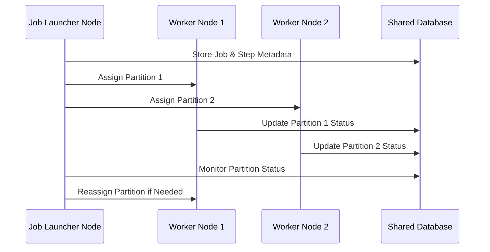

# Spring Batch Database Cluster Partitioning

[](https://opensource.org/licenses/Apache-2.0)
[](https://github.com/jchejarla/spring-batch-db-cluster-partitioning/actions/workflows/maven.yml)
[](https://search.maven.org/artifact/io.github.jchejarla/spring-batch-db-cluster-core)
[](https://doi.org/10.21105/joss.09460)
[](https://jchejarla.github.io/spring-batch-db-cluster-partitioning/)

📖 **[Project website →](https://jchejarla.github.io/spring-batch-db-cluster-partitioning/)**

## 🧭 Table of Contents

- [Overview](#-overview)
- [Key Features](#-key-features)
- [How It Works](#-how-it-works)
- [Architecture](#architecture)
- [Sequence diagram](#sequence-diagram)
- [Featured In](#-featured-in)
- [Actuator Endpoints](#-actuator-endpoints)
- [Getting Started](#-getting-started)
  - [Prerequisites](#prerequisites)
  - [Installation (as a Maven/Gradle dependency)](#installation-as-a-mavengradle-dependency)
  - [Database Setup](#database-setup)
  - [PostgreSQL Example Schema](#postgresql-example-schema)
  - [Configuration](#configuration)
  - [Usage](#usage)
- [Performance and Scalability](#-performance-and-scalability)
- [Fault Tolerance](#-fault-tolerance)
- [FAQ](#-faq)
- [Contributing](#-contributing)
- [Citation](#-citation)
- [License](#-license)
- [Contact](#-contact)


## 🚀 Overview

This project delivers **database-coordinated distributed partitioning for Spring Batch** — scalable, fault-tolerant execution of batch jobs across multiple JVM instances (nodes), with all cluster coordination handled through the **relational database you already operate**. It provides dynamic task assignment, explicit partition-state tracking, and reliable fault detection and recovery, while keeping deployment lightweight — no additional messaging or coordination infrastructure to stand up, scale, or monitor.

This approach simplifies the architecture, provides real-time visibility into job progress, and ensures robust task re-assignment upon node failures, all while minimizing changes to existing Spring Batch application logic.

The core principles of this project is to know **number of available nodes** upfront so that the efficient tasks partitioning and distribution strategy can be determined at runtime, and **facilitate easy failover** in the event of any cluster node is not responding.

> 📐 For the full design rationale, fault-tolerance model, and a comparison with related approaches, see **[docs/DESIGN.md](docs/DESIGN.md)**.

## ✨ Key Features
* **Decentralized Master Election:** No central master node required — the node that initiates the job automatically becomes the master for that execution, enabling fully autonomous job launches across the cluster.
* **Proactive Node Awareness:** Before partitioning, the master node dynamically queries the cluster state to **identify all currently active nodes**. This enables smarter distribution strategies (e.g., round-robin, fixed-node allocation) based on **real-time availability**, avoiding delays or imbalance caused by late-arriving workers. Importantly, **the number of available nodes is also passed to the task builder logic**, empowering end users to construct task partitions that are tailored to the **current cluster size**. This allows for more **efficient execution planning** and better resource utilization.
* **Database-Driven Coordination:** Utilizes a common relational database (e.g., PostgreSQL, Oracle, MySQL) as the central hub for cluster state management.
* **Dynamic Node Awareness:** Master nodes discover and assign partitions to active worker nodes in real-time by querying the database.
* **Flexible Partitioning Strategies:**
    * **Round-Robin:** Evenly distributes partitions across available nodes.
    * **Fixed Node Count:** Assigns partitions to a specified number of nodes.
    * **Least-Loaded:** Load-aware — assigns each partition to the node with the lowest live load, steering work away from nodes already busy with other jobs.
* **Explicit Task State Tracking:** Every partition's lifecycle (PENDING, CLAIMED, COMPLETED, FAILED) is transactionally recorded, offering unparalleled visibility.
* **Robust Fault Tolerance:**
    * **Node Heartbeats:** Worker nodes periodically update their liveness, enabling master nodes to detect unresponsive instances.
    * **Configurable Task Re-assignment:** Uncompleted tasks from failed nodes can be automatically re-assigned to healthy nodes, ensuring job completion.
* **Self-Contained Coordination:** All cluster state lives in your existing relational database, keeping the deployment lightweight — no separate messaging or cluster-management service to operate.
* **Customizable Callbacks:** Provides interfaces for custom logic upon overall job success or failure.

## 🛠 How it Works

1.  **Node Registration:** Each Spring Batch instance (master and worker) registers itself in the `BATCH_NODES` table upon startup and sends periodic heartbeats.
2.  **Partitioning (Master Node):**
    * A custom `ClusterAwarePartitioner` queries the `BATCH_NODES` table to identify active workers.
    * It then splits the job's workload into `ExecutionContext` partitions.
    * Based on a chosen `PartitionStrategy` (e.g., Round-Robin), it assigns these partitions to active worker nodes and records them in the `BATCH_PARTITIONS` table with a 'PENDING' status.
3.  **Task Execution (Worker Nodes):**
    * Each `PartitionWorkerTasksRunner` on a worker node continuously polls the `BATCH_PARTITIONS` table for tasks assigned to it.
    * Upon picking up a task, it immediately updates its status to 'CLAIMED' transactionally.
    * The worker then executes the assigned Spring Batch `Step`.
    * Throughout execution, and upon completion/failure, the worker updates the task's status in `BATCH_PARTITIONS` and the Spring Batch `JobRepository`.
4.  **Fault Tolerance:**
    * If a worker node fails, its heartbeats stop. After a configurable timeout, the master node (or another designated process) marks the node as `UNREACHABLE` in `BATCH_NODES` and eventually removes it.
    * Any 'CLAIMED' or 'PENDING' partitions associated with the failed node that are marked `is_transferable` are identified and made available for re-assignment to other active nodes, ensuring the job completes.
5.  **Aggregation:** The `ClusterAwareAggregator` collects results from all partitions, updating the master job's status and invoking success/failure callbacks.

## Architecture 


```mermaid
graph TD
    A[Job Launcher Node] --> B[Job Execution]
    B --> C{Step Type}
    C -->|Single Step| D[Execute Locally]
    C -->|Partitioned Step| E[Distribute Partitions]
    E --> F[Worker Node 1]
    E --> G[Worker Node 2]
    E --> H[Worker Node N]
    F --> I[Process Partition]
    G --> J[Process Partition]
    H --> K[Process Partition]
    I --> L[Update Status]
    J --> L
    K --> L
    L --> M[Master Monitors & Reassigns if Needed]
```

## Sequence diagram


```mermaid

sequenceDiagram
    participant Master as Job Launcher Node
    participant Worker1 as Worker Node 1
    participant Worker2 as Worker Node 2
    participant DB as Shared Database

    Master->>DB: Store Job & Step Metadata
    Master->>Worker1: Assign Partition 1
    Master->>Worker2: Assign Partition 2
    Worker1->>DB: Update Partition 1 Status
    Worker2->>DB: Update Partition 2 Status
    Master->>DB: Monitor Partition Status
    Master->>Worker1: Reassign Partition if Needed

```
## 📚 Featured In
* [📝 TechRxiv Preprint](https://www.techrxiv.org/users/944717/articles/1314759-spring-batch-database-backed-clustered-partitioning-a-lightweight-coordination-framework-for-distributed-job-execution)
  *Spring Batch Database-Backed Clustered Partitioning* — 98+ views, 27+ downloads
* [✍️ Dev.to Overview Article](https://dev.to/jchejarla/spring-batch-clustering-with-zero-messaging-introducing-spring-batch-db-cluster-partitioning-39p4)
  *Introduction to the coordination framework* — 171+ views
* [📘 Article Series: Distributed Spring Batch Coordination](https://dev.to/jchejarla/distributed-spring-batch-coordination-part-1-the-problem-with-traditional-spring-batch-scaling-3he4)
  * Distributed Spring Batch Coordination: Lightweight, Database-Driven, and Cloud-Native Series' Articles
* [📚 Differ.blog Feature](https://differ.blog/p/distributed-spring-batch-clustering-a-lightweight-alternative-to-heav-8225f3)
  * Distributed Spring Batch Clustering: A Lightweight Alternative to Heavy Orchestration
* ✨ Coming Soon
  Medium/In Plain English article on production usage patterns and lessons learned.

## 🔍 Actuator Endpoints

| Endpoint                            | Description                                  |
|-------------------------------------|----------------------------------------------|
| `/actuator/health`                 | Shows cluster-aware health status            |
| `/actuator/batch-cluster`         | Cluster overview of node executions         |
| `/actuator/batch-cluster/{nodeId}`| Details of a specific node        |
| `/actuator/batch-cluster-jobs`    | Lists coordinated jobs                       |
| `/actuator/batch-cluster-jobs/{jobExecutionId}` | Job-centric view: master node, partition count, status histogram, per-partition placement |

> ⚠️ **Security:** these endpoints expose operational detail about nodes and partition assignments. Treat them like any other actuator endpoint — restrict their exposure (`management.endpoints.web.exposure.include`) and protect them with authentication/authorization. Don't expose `batch-cluster` unauthenticated on a public interface.

## 📦 Getting Started

### Version Compatibility

| Library version | Spring Boot | Spring Batch | Java | Branch | Status |
|---|---|---|---|---|---|
| 3.x | 4.1+ | 6.x | 21+ | `main` | Active development |
| 2.x | 3.x | 5.x | 17+ | `2.x` | Maintenance (bug and security fixes; feature backports considered on request) |

Upgrading from 2.x? See the [Migration Guide](docs/migration.md).

### Prerequisites

* **Java 21+**
* **Spring Boot 4.1+ / Spring Batch 6** (the 2.x line targets Spring Boot 3)
* Maven 3.x or Gradle 7.x+
* A relational database (e.g., PostgreSQL, MySQL, Oracle, H2 for development)
* A **JDBC-backed `JobRepository`** — Spring Batch 6 defaults to an in-memory repository, which cannot
  coordinate a cluster. Enable JDBC with `@EnableBatchProcessing` + `@EnableJdbcJobRepository`
  (clustering fails fast at startup otherwise). See [Database Setup](#database-setup).

### Installation (as a Maven/Gradle dependency)

Add the following to your `pom.xml` (for Maven):

```xml
<dependency>
    <groupId>io.github.jchejarla</groupId>
    <artifactId>spring-batch-db-cluster-core</artifactId>
    <version>2.0.0</version>
</dependency>
```
If you are using a SNAPSHOT version of the jar (snapshot version is not an official release, this is just for testing purpose), then add below snapshot repository URL into pom.xml

```xml
    <repositories>
        <repository>
            <id>central-snapshots</id>
            <url>https://central.sonatype.com/repository/maven-snapshots/</url>
            <snapshots><enabled>true</enabled></snapshots>
            <releases><enabled>false</enabled></releases>
        </repository>
    </repositories>
```

Or for Gradle:

```gradle
implementation 'io.github.jchejarla:spring-batch-db-cluster-core:2.0.0' // Use the latest version
```
> **_NOTE:_** The artifact has been deployed to Maven Central for direct consumption. For local development, you might need to build and install it to your local Maven repository (<code>mvn clean install</code>).

### Database Setup

This library extends Spring Batch, so two layers of schema need to exist in your database:

**1. Spring Batch core schema** (required prerequisite)

The standard Spring Batch metadata tables (`BATCH_JOB_INSTANCE`, `BATCH_JOB_EXECUTION`, `BATCH_STEP_EXECUTION`, etc.) must exist. **Spring Boot 4 no longer auto-initializes them** (`spring.batch.jdbc.initialize-schema` was removed), so create them with one of:

- **A migration tool** (recommended for production) — Flyway or Liquibase.
- **`spring.sql.init`**, pointing at the bundled Spring Batch DDL:
  ```yaml
  spring:
    sql:
      init:
        mode: always
        schema-locations: classpath:org/springframework/batch/core/schema-@@platform@@.sql
  ```
- **Manually**, from the [Spring Batch 6.0 DDL scripts](https://github.com/spring-projects/spring-batch/tree/6.0.x/spring-batch-core/src/main/resources/org/springframework/batch/core) for your database.

  Use the Spring Batch version that matches the one this library depends on (currently 6.0.x).

**2. Cluster partitioning tables** (provided by this library)

This library adds four additional tables (`BATCH_NODES`, `BATCH_JOB_COORDINATION`, `BATCH_PARTITIONS`, and the opt-in `BATCH_JOB_PHASE_EVENTS`) for cluster state, partition assignment, heartbeat tracking, and phase-timing. SQL scripts for PostgreSQL, MySQL, MariaDB, Oracle, SQL Server, Db2, and H2 are bundled in [`spring-batch-db-cluster-core/src/main/resources/schema/`](https://github.com/jchejarla/spring-batch-db-cluster-partitioning/tree/main/spring-batch-db-cluster-core/src/main/resources/schema). Apply the one matching your database, or use the inline PostgreSQL example below.

  For development, the framework can also create these tables for you on startup — set
  `spring.batch.cluster.initialize-schema` to `embedded` (the default; creates them only on embedded
  databases such as H2), `always`, or `never`. It runs after the Spring Batch schema (ordered via
  `@DependsOnDatabaseInitialization`, so it works with Flyway/Liquibase/`spring.sql.init`) so the foreign
  keys resolve. For production, prefer a managed migration tool or apply the bundled DDL manually.

### PostgreSQL Example Schema:

```sql
-- Table: BATCH_NODES - maintains cluster nodes heartbeat
CREATE TABLE BATCH_NODES (
    NODE_ID VARCHAR(200) NOT NULL PRIMARY KEY,
    CREATED_TIME TIMESTAMP NOT NULL,
    LAST_UPDATED_TIME TIMESTAMP NOT NULL,
    STATUS VARCHAR(20) NOT NULL, -- Indicates node status (e.g., ACTIVE, UNREACHABLE)
    HOST_IDENTIFIER VARCHAR(200),
    CURRENT_LOAD BIGINT NOT NULL DEFAULT 0
);

-- Table: BATCH_JOB_COORDINATION - Job coordination
CREATE TABLE BATCH_JOB_COORDINATION (
    JOB_EXECUTION_ID BIGINT PRIMARY KEY,
    MASTER_NODE_ID VARCHAR(200) NOT NULL,
    MASTER_STEP_EXECUTION_ID BIGINT NOT NULL,
    MASTER_STEP_NAME VARCHAR(100) NOT NULL,
    STATUS VARCHAR(20) NOT NULL,
    CREATED_TIME TIMESTAMP NOT NULL,
    LAST_UPDATED TIMESTAMP NOT NULL,
    constraint JOB_COORD_FK FOREIGN KEY (JOB_EXECUTION_ID) REFERENCES BATCH_JOB_EXECUTION(JOB_EXECUTION_ID)
);

-- Table: BATCH_PARTITIONS - Partition tracking
CREATE TABLE BATCH_PARTITIONS (
    step_execution_id BIGINT PRIMARY KEY,
    job_execution_id BIGINT NOT NULL,
    partition_key VARCHAR(100) NOT NULL,
    assigned_node VARCHAR(100),
    status VARCHAR(20) NOT NULL CHECK (status IN ('PENDING', 'CLAIMED', 'COMPLETED', 'FAILED')),
    last_updated TIMESTAMP DEFAULT CURRENT_TIMESTAMP,
    master_step_execution_id BIGINT NOT NULL,
    is_transferable SMALLINT DEFAULT 0,
    CHECK (is_transferable IN (0, 1)),
    CONSTRAINT BAT_PART_FK
        FOREIGN KEY (step_execution_id)
        REFERENCES BATCH_STEP_EXECUTION(step_execution_id)
        ON DELETE CASCADE
);
```

### Configuration

Enable the cluster partitioning by adding the following to your <code>application.properties</code> (or <code>application.yml</code>):

```properties
# Enable the cluster partitioning feature
spring.batch.cluster.enabled=true

# Optional readable prefix for this node's id (defaults to the host name).
# The framework always appends a unique suffix, so each node id is unique per JVM and per restart.
spring.batch.cluster.node-id-prefix=${HOSTNAME:my-batch-node}

# How often this node sends a heartbeat to the database (in milliseconds)
spring.batch.cluster.heartbeat-interval=3000 # 3 seconds

# How often worker nodes poll for new tasks (in milliseconds)
spring.batch.cluster.task-polling-interval=1000 # 1 second

# Time in milliseconds after which a node is considered unreachable if no heartbeat is received
spring.batch.cluster.unreachable-node-threshold=15000 # 15 seconds

# Time in milliseconds after which an unreachable node's entry is removed from BATCH_NODES
spring.batch.cluster.node-cleanup-threshold=60000 # 60 seconds (after becoming unreachable)
```

### Usage
1. Define your <code>ClusterAwarePartitioner</code>: Extend the <code>ClusterAwarePartitioner</code> abstract class.

```java
@Configuration
public class MyJobPartitioner extends ClusterAwarePartitioner {

    @Override
    public List<ExecutionContext> splitIntoChunksForDistribution(int availableNodeCount) {
        // Example: Create 10 partitions, distributing across available nodes
        List<ExecutionContext> contexts = new ArrayList<>();
        for (int i = 0; i < 10; i++) {
            ExecutionContext context = new ExecutionContext();
            context.putLong("startRange", i * 100000L);
            context.putLong("endRange", (i + 1) * 100000L - 1);
            contexts.add(context);
        }
        return contexts;
    }

    @Override
    public PartitionTransferableProp arePartitionsTransferableWhenNodeFailed() {
        // Set to YES if partitions can be re-assigned to other nodes on failure
        return PartitionTransferableProp.YES;
    }

    @Override
    public PartitionBuilder buildPartitionStrategy() {
        // Example: Use Round-Robin strategy
        return PartitionBuilder.builder().partitioningMode(PartitioningMode.ROUND_ROBIN).build();

        // Or, Fixed Node Count:
        // return PartitionBuilder.builder().partitioningMode(PartitioningMode.FIXED_NODE_COUNT).fixedNodeCount(3).build();

        // Or, Least-Loaded (load-aware: assigns to the least-busy nodes based on live load):
        // return PartitionBuilder.builder().partitioningMode(PartitioningMode.LEAST_LOADED).build();
    }
}
```

2. Configure your partitioned step: Use your custom <code>ClusterAwarePartitioner</code> and a Step (e.g., a <code>TaskletStep</code> or <code>ItemReader/Writer</code> based step) that will be executed by each partition.

```java
@Configuration
public class MyJobConfig {

    @Autowired
    private JobRepository jobRepository;
    @Autowired
    private PlatformTransactionManager transactionManager;
    @Autowired
    private TaskExecutor taskExecutor; // For worker threads
    @Autowired
    private MyJobPartitioner myJobPartitioner; // Your custom partitioner
    @Autowired
    private ClusterAwareAggregator clusterAwareAggregator; // Provided by the library

    @Bean
    public Step partitionedWorkerStep() {
        return new StepBuilder("partitionedWorkerStep", jobRepository)
            .tasklet((contribution, chunkContext) -> {
                // This is the logic executed by each partition
                ExecutionContext stepContext = chunkContext.getStepContext().getStepExecution().getExecutionContext();
                Long startRange = stepContext.getLong("startRange");
                Long endRange = stepContext.getLong("endRange");
                String nodeId = stepContext.getString(ClusterPartitioningConstants.CLUSTER_NODE_IDENTIFIER);
                Boolean isTransferable = stepContext.getBoolean(ClusterPartitioningConstants.IS_TRANSFERABLE_IDENTIFIER);

                System.out.println(String.format("Node %s processing range %d to %d. IsTransferable: %s",
                        nodeId, startRange, endRange, isTransferable));

                // Simulate work
                long sum = 0;
                for (long i = startRange; i <= endRange; i++) {
                    sum += i;
                }
                System.out.println(String.format("Node %s finished range. Sum: %d", nodeId, sum));
                return RepeatStatus.FINISHED;
            }, transactionManager)
            .build();
    }

    @Bean
    public Step masterStep(JobExplorer jobExplorer) {
        return new StepBuilder("masterStep", jobRepository)
            .partitioner("partitionedWorkerStep", myJobPartitioner)
            .step(partitionedWorkerStep()) // The step to be executed by workers
            .aggregator(clusterAwareAggregator) // Optional: For custom success/failure callbacks
            .taskExecutor(taskExecutor) // Local task executor for master coordination, or simple direct call for small workloads
            .build();
    }

    @Bean
    public Job myPartitionedJob(Step masterStep) {
        return new JobBuilder("myPartitionedJob", jobRepository)
            .start(masterStep)
            .build();
    }

    // Example of a custom callback for aggregation
    @Bean
    public ClusterAwareAggregatorCallback myJobCompletionCallback() {
        return new ClusterAwareAggregatorCallback() {
            @Override
            public void onSuccess(Collection<StepExecution> executions) {
                System.out.println("Partitioned Job Completed Successfully!");
                executions.forEach(se -> System.out.println("  Partition " + se.getStepName() + " on node " + se.getExecutionContext().getString(ClusterPartitioningConstants.CLUSTER_NODE_IDENTIFIER) + ": " + se.getStatus()));
            }

            @Override
            public void onFailure(Collection<StepExecution> executions) {
                System.err.println("Partitioned Job FAILED!");
                executions.forEach(se -> System.err.println("  Partition " + se.getStepName() + " on node " + se.getExecutionContext().getString(ClusterPartitioningConstants.CLUSTER_NODE_IDENTIFIER) + ": " + se.getStatus() + " (" + se.getExitStatus().getExitDescription() + ")"));
            }
        };
    }
}
```
3. Run Multiple Instances: Start multiple instances of your Spring Boot application. Each node automatically receives a unique id (optionally prefixed via <code>spring.batch.cluster.node-id-prefix</code>), so no per-instance configuration is required. One instance will act as the master (initiating the job), and others will automatically register as workers.

### Running the Bundled Examples

The `examples/` module contains a runnable Spring Boot application that demonstrates simple, advanced (ETL), and task-executor jobs against a real cluster of two or more JVMs.

**See [`examples/README.md`](examples/README.md)** for the complete step-by-step quick start — provisioning PostgreSQL, applying both schemas, building, starting multiple workers, triggering jobs, observing partition state, and testing failover. The example module also documents how to switch to MySQL or Oracle, and includes a zero-setup H2 profile for users who want to verify functionality without provisioning an external database.

## 📈 Performance and Scalability

This solution enables true horizontal scalability by distributing batch workloads across distinct physical or virtual machines. Performance benchmarks demonstrate significant reductions in job execution time as more worker nodes are added, effectively leveraging distributed computing resources.

## 🛡 Fault Tolerance

The database-centric approach provides robust fault tolerance. In the event of a worker node failure, its assigned tasks (if marked as transferable) are identified via the database and re-assigned to other active nodes, ensuring job completion without manual intervention or data loss.

## ❓ FAQ

**Why coordinate through the database instead of a message broker like Kafka or RabbitMQ?**
The limitation was never in the brokers — they deliver messages reliably. The gap is in how Spring Batch's standard remote partitioning *uses* them: as a fire-and-forget dispatch channel. The master can't tell how many workers are alive before partitioning, and once a partition is dispatched there's no built-in way to detect a worker that died after receiving it. Those are coordination concerns a broker was never meant to address. This extension adds that coordination layer — proactive node awareness, transactional partition lifecycle tracking, and heartbeat-based failover — using the relational database Spring Batch already requires, so there's no additional infrastructure to deploy or operate.

**How is this different from Spring Cloud Task's `DeployerPartitionHandler`?**
`DeployerPartitionHandler` is also broker-free and coordinates through the job repository, but it *provisions a worker per partition* via a deployment platform (Kubernetes, Cloud Foundry, etc.). This extension instead coordinates a **standing cluster of peer JVM nodes** that poll for work — no deployment platform required — and it queries how many nodes are actually live before partitioning, sizing the workload to the cluster you already have.

**Do I have to launch jobs a particular way (synchronous vs. asynchronous)?**
No. How you define and launch jobs is entirely yours and remains standard Spring Batch. If you trigger jobs over HTTP and don't want the request thread blocked for the job's duration, configure an asynchronous `JobLauncher` (a `TaskExecutor`) and poll execution status — that's a native Spring Batch capability, nothing extra here.

**What happens when a worker node dies mid-job?**
Its heartbeat stops, so it is marked unreachable and then removed. Its incomplete partitions — if marked transferable — are detected via the database and reassigned to healthy nodes. Partitions marked non-transferable are not moved (a deliberate safety contract for work with node-local state or non-idempotent side effects).

**What happens when the master node dies?**
Because mastership is per-job-execution, only that one job is affected — the rest of the cluster keeps running. A surviving node detects the lost master and marks the stranded job execution failed so it becomes cleanly restartable (rather than hanging forever). Automatic resumption of such a job on another node is on the roadmap.

**Which databases are supported?**
PostgreSQL, MySQL, MariaDB, Oracle, SQL Server, Db2, and H2, via per-database query providers. H2 (file mode) is handy for local multi-node demos; the others for production.

**How large a cluster does this target?**
Small-to-medium clusters — roughly 2–20 nodes — where database throughput comfortably handles heartbeat and partition-tracking traffic. For far larger clusters or sub-second coordination needs, a dedicated coordination service or broker-based architecture may fit better.

## 🤝 Contributing

Contributions are welcome! Please feel free to open issues, submit pull requests, or suggest improvements.

## 📖 Citation

If you use this software in your work, please cite the JOSS paper:

> Chejarla, J. R., (2026). spring-batch-db-cluster-partitioning: Database-driven clustering with heartbeats and failover for Spring Batch. *Journal of Open Source Software*, 11(122), 9460, https://doi.org/10.21105/joss.09460

```bibtex
@article{Chejarla_2026,
  author    = {Chejarla, Janardhan Reddy},
  title     = {spring-batch-db-cluster-partitioning: Database-driven clustering with heartbeats and failover for Spring Batch},
  journal   = {Journal of Open Source Software},
  publisher = {The Open Journal},
  year      = {2026},
  month     = jun,
  volume    = {11},
  number    = {122},
  pages     = {9460},
  issn      = {2475-9066},
  doi       = {10.21105/joss.09460},
  url       = {https://doi.org/10.21105/joss.09460}
}
```

## 📄 License
This project is licensed under the Apache 2.0 License - see the LICENSE file for details.

## 📧 Contact
Janardhan Chejarla - janardhan.chejarla@googlemail.com


