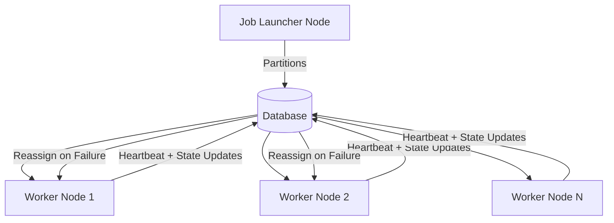

# Summary

`spring-batch-db-cluster-partitioning` is an open-source extension for Spring Batch [@springbatch].
It introduces **database-driven clustering** that provides **node heartbeats, partition lifecycle tracking, and automatic failover** using a shared relational database.
The framework enables **horizontal scale-out and fault tolerance** for partitioned jobs while remaining fully compatible with the Spring Batch programming model.

# Statement of Need

Spring Batch supports local parallelism [@springbatch_scaling] and remote partitioning through a messaging layer [@spring_integration_remote_partitioning].
While effective, these modes require either execution within a single JVM or the addition of messaging infrastructure for coordination.  
This framework instead uses the relational database itself as the coordination plane.  
Nodes register with heartbeats, so the set of available workers is explicit and continuously visible, simplifying operations while improving **reproducibility, observability, and resilience**.

Typical use cases include **ETL (Extract–Transform–Load) workflows** where large datasets must be cleaned, transformed, or aggregated in parallel.
By coordinating work through the database, this framework allows such pipelines to be executed across multiple machines in a cluster without requiring brokers or external schedulers.

# Functionality

The framework provides:

- **Cluster node registry**: active nodes register in a `BATCH_NODES` table with periodic heartbeats.
- **Two-phase liveness detection**: nodes are first marked `UNREACHABLE`, then removed after a cleanup threshold, reducing false positives.
- **Partition lifecycle management**: partitions tracked in `BATCH_PARTITIONS` with states `PENDING`, `CLAIMED`, `COMPLETED`, `FAILED`.
- **Automatic failover**: transferable partitions from failed nodes are reassigned to healthy ones.
- **Distribution strategies**: round-robin, fixed-node, and dynamic assignment.
- **Spring-native integration**: no changes required to job or step definitions.

# Architecture

Coordination state is persisted in three relational tables:

- **`BATCH_NODES`** records active cluster nodes and their heartbeats.
- **`BATCH_PARTITIONS`** tracks partition ownership and lifecycle transitions (pending, claimed, completed, failed).
- **`BATCH_JOB_COORDINATION`** manages per-step coordination metadata within a job.

These tables collectively enable liveness detection, partition assignment, and safe failover.  
Full DDL schemas and examples are provided in the project repository.

# Failure handling

- **Heartbeats** ensure each node regularly updates its liveness.
- **Two-phase detection** separates *marking unreachable* from *deletion and reassignment*.
- **Transactional partition claims** prevent double execution.
- **Automatic recovery** reassigns incomplete partitions from failed nodes to available ones.
- **Idempotent transitions** allow safe retries without duplicate processing.

# Configuration

Example Spring Boot properties:

```yaml
spring.batch.cluster.enabled=true
spring.batch.cluster.node-id=${HOSTNAME:my-node-01}
spring.batch.cluster.heartbeat-interval=3000
spring.batch.cluster.task-polling-interval=1000
spring.batch.cluster.unreachable-node-threshold=15000
spring.batch.cluster.node-cleanup-threshold=60000
```

# State of the field

Scientific workflow systems such as Pegasus [@deelman2015pegasus], Kepler [@ludascher2006kepler], and Taverna [@wolstencroft2013taverna] emphasize reproducibility and durable state.  
Spring Batch provides a lightweight framework for batch workloads within the Java ecosystem [@springbatch].  
This extension adds **cluster coordination and failover** directly within Spring Batch, using only a relational database.  
It complements external schedulers (e.g., Spring Cloud Data Flow [@scdf]) and coordination services (e.g., ZooKeeper [@hunt2010zookeeper], Chubby [@burrows2006chubby], Raft [@ongaro2014raft]) by embedding coordination at the framework level.

# Limitations

- Targets **small-to-medium clusters** where database throughput is sufficient.
- Relies on a highly available database; replication and backup are required in production.
- Not optimized for ultra-large clusters or sub-second coordination latency, where external services may be more appropriate.

# Diagram



# Acknowledgements

Built on Spring Batch / Spring Boot.  
Source code: [@project_repo].

# References
