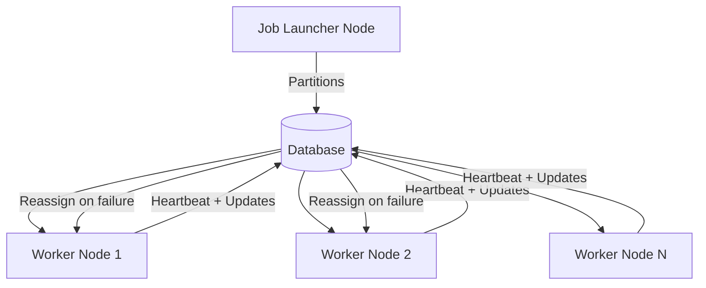

# Summary

`spring-batch-db-cluster-partitioning` is an open-source library that adds **database-driven clustering** to Spring Batch [@springbatch].
It provides **node heartbeats, explicit partition lifecycle, and automatic failover** using only a shared relational database.
This enables **horizontal scale** and **fault tolerance** for partitioned steps across multiple JVMs or machines **without external messaging middleware**, while remaining idiomatic to Spring Batch.

# Statement of Need

Spring Batch offers local parallelism within a single JVM [@springbatch_scaling] and remote partitioning that depends on messaging middleware [@spring_integration_remote_partitioning].
Neither option supplies a **DB-first** coordination model with **node liveness tracking** and **transactional partition state** suitable for simple, predictable operations.
Many Spring Batch deployments already include a relational database; leveraging it as the cluster’s coordination plane removes extra moving parts while improving visibility and recoverability.
This library fills that gap: it integrates **heartbeats, partition assignment, status tracking, and safe re-assignment** directly into Spring Batch workflows.

# Functionality

The main capabilities of the library include:

- **Cluster node registry & heartbeats** in a `BATCH_NODES` table with configurable timeouts.
- **Partition lifecycle management** tracked in `BATCH_PARTITIONS` (PENDING/CLAIMED/COMPLETED/FAILED).
- **Automatic failover**: incomplete, `is_transferable` partitions are safely re-assigned on node failure.
- **Master-per-job** design: the launcher of a job acts as its master; no global controller/election.
- **Flexible distribution strategies**: round-robin, fixed-node, and dynamic.
- **Database compatibility**: Oracle, PostgreSQL, MySQL, H2 (for testing).
- **Spring-native integration**: jobs/steps defined using Spring Batch APIs remain unchanged.

# Example Usage

A partitioned step can be defined using standard Spring Batch APIs.  
The cluster coordination is enabled and configured entirely through Spring Boot properties:

```yaml
# Enable the cluster partitioning feature
spring.batch.cluster.enabled=true

# Unique identifier for this node instance
spring.batch.cluster.node-id=${HOSTNAME:my-batch-node-01}

# How often this node sends a heartbeat to the database (in milliseconds)
spring.batch.cluster.heartbeat-interval=3000 # 3 seconds

# How often worker nodes poll for new tasks (in milliseconds)
spring.batch.cluster.task-polling-interval=1000 # 1 second

# Time in milliseconds after which a node is considered unreachable if no heartbeat is received
spring.batch.cluster.unreachable-node-threshold=15000 # 15 seconds

# Time in milliseconds after which an unreachable node's entry is removed from BATCH_NODES
spring.batch.cluster.node-cleanup-threshold=60000 # 60 seconds (after becoming unreachable)
```

With this configuration, all active nodes in the cluster register themselves, send periodic heartbeats, and poll for partitions.
If a node becomes unreachable, its partitions are re-assigned to healthy nodes, ensuring job completion without manual intervention.

# State of the Field

Spring Batch’s `TaskExecutorPartitionHandler` parallelizes only within one JVM [@springbatch_scaling];
`MessageChannelPartitionHandler` uses Spring Integration with brokers for remote partitioning [@spring_integration_remote_partitioning].

Tools like Spring Cloud Data Flow [@scdf] or external orchestrators (e.g., Kubernetes) can schedule and launch Spring Batch jobs,
but they operate at the **deployment and scheduling layer**, not at the **partition coordination layer inside Spring Batch**.
In contrast, this library adds a **database-driven heartbeat and partition-state model directly within Spring Batch** itself.

Alternative distributed engines such as Spark [@zaharia2012spark] and Flink [@carbone2015flink] provide their own runtime models,
but adopting them requires significant architectural migration away from Spring Batch.
Our contribution is intentionally pragmatic: to strengthen Spring Batch by providing **built-in, database-backed cluster coordination**
without additional middleware or platform migration.

# Diagram



# Acknowledgements

Built on the Spring Batch/Spring Boot ecosystem; informed by practical needs in enterprise batch processing.
The full source code is available at [@project_repo].

# References
