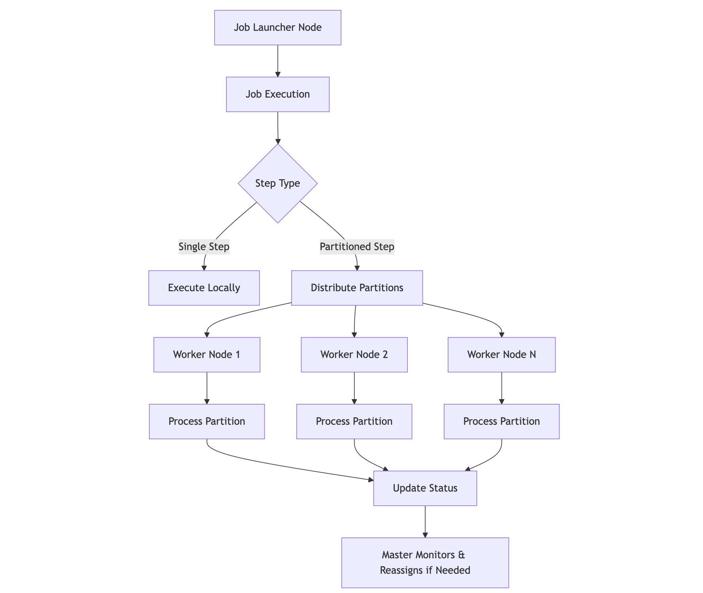

# Summary

Batch processing of large datasets — transforming, validating, or migrating millions of records in a single run — is a routine requirement across scientific and enterprise computing, with well-documented use in bioinformatics and clinical informatics [@wolstencroft2013taverna], in the Earth and climate sciences [@cinquini2014esgf], and in financial services [@cogoluegnes2011springbatch]. Spring Batch [@springbatch] is a widely used Java framework for these workloads, providing transactional chunk processing, restart semantics, and a rich programming model. When a single machine cannot process the data fast enough, Spring Batch supports *remote partitioning*: the work is split into partitions and dispatched to worker nodes through a messaging layer such as RabbitMQ or Apache Kafka [@spring_integration_remote_partitioning].

However, operating a highly available message broker solely for partition coordination adds significant infrastructure overhead — deployment, monitoring, and failure handling for a component that is incidental to the batch workload itself. More critically, the message-based model provides no built-in mechanism for the master node to discover how many workers are actually available, or to detect and recover from a worker crash after a partition has been dispatched.

`spring-batch-db-cluster-partitioning` is an open-source Java extension that replaces the messaging layer with the relational database that Spring Batch already requires. It introduces three capabilities absent from the standard remote partitioning model: (1) **proactive node awareness**, allowing the master to query exactly how many workers are active before distributing work; (2) **explicit partition lifecycle tracking**, recording each partition's state (`PENDING`, `CLAIMED`, `COMPLETED`, `FAILED`) transactionally so that no work is silently lost; and (3) **automatic failover**, detecting unresponsive nodes via heartbeat timeouts and reassigning their incomplete partitions to healthy workers without human intervention. By persisting all coordination state in standard SQL tables, the extension eliminates the operational burden of a message broker while simultaneously providing real-time visibility into job progress through ordinary SQL queries.

# Statement of Need

Spring Batch is used in research-adjacent and enterprise contexts where reproducible, auditable processing of large datasets is essential. In bioinformatics, workflow-based pipelines process sequencing data and clinical datasets at scale [@wolstencroft2013taverna]. In the Earth and climate sciences, federated infrastructures coordinate the ingestion and processing of model output across petabyte-scale archives [@cinquini2014esgf]. In financial services, batch processing underpins end-of-day reconciliation, payment processing, and regulatory reporting [@cogoluegnes2011springbatch]. In each case, horizontal scale-out — distributing partitions across multiple worker nodes — is a common strategy for meeting processing-time targets.

Spring Batch offers two parallelism models [@springbatch_scaling]: local multi-threaded partitioning within a single JVM, and remote partitioning across multiple JVMs via a messaging middleware [@spring_integration_remote_partitioning]. Local partitioning is bounded by the resources of a single machine. Remote partitioning removes this ceiling but introduces a critical operational challenge: the master node dispatches partitions through a message queue and has no direct knowledge of how many workers are active, or whether a worker that received a partition has completed, failed, or silently died. If a worker crashes after claiming a partition but before acknowledging completion, the master has no reliable mechanism to detect this and reassign the work. Timeout-based recovery requires careful tuning and still introduces indefinite blocking during failure scenarios [@tanenbaum2007distributed].

This extension addresses these gaps by using the relational database as the coordination plane. The design produces several concrete benefits. First, topology visibility: the master queries a `BATCH_NODES` table before partitioning, so it knows the exact number of active workers and can distribute work proportionally — enabling partition counts that scale with the available cluster size at runtime. Second, guaranteed state durability: every partition state transition is committed transactionally, so a worker crash leaves a recoverable record rather than a lost message. Third, simplified architecture: teams already operating a production database incur no additional infrastructure to coordinate batch workers. Fourth, operational observability: standard SQL queries expose live job status, partition progress, and node health without specialised tooling.

The performance benefit is direct: a job that takes 60 minutes on a single node can complete in approximately 15 minutes across four workers using round-robin distribution, with near-linear speedup for I/O-bound workloads. The extension adds only lightweight SQL operations (heartbeat writes, partition claim updates) whose overhead is negligible relative to the batch workload itself.

The target users are Java development teams running Spring Batch workloads that require horizontal scale-out or fault-tolerant execution, particularly in environments where introducing a message broker is undesirable due to operational constraints, compliance requirements, or infrastructure simplicity goals. A Spring-centric implementation was chosen deliberately: this extension uses Spring Batch's native partitioning API, requiring no changes to existing job or step definitions. Spring Batch has been a complete implementation of JSR-352 (Jakarta Batch) [@jsr352] since version 3.0, and the JSR-352 specification defines closely analogous partitioning artifacts (`PartitionMapper`, `PartitionAnalyzer`, `PartitionReducer`) that mirror Spring Batch's `Partitioner` and aggregator. The coordination mechanism (message broker vs. shared database) is orthogonal to the framework API surface, and the database-driven approach described here could be re-implemented against the JSR-352 partitioning artifacts with the same semantics, in line with the broader Java ecosystem's emphasis on specification-driven interoperability.

# Software Design

The extension is organised around three coordination tables that augment Spring Batch's existing `JobRepository` schema. The `BATCH_NODES` table records every active cluster node alongside a periodically refreshed heartbeat timestamp. The `BATCH_PARTITIONS` table tracks each partition's lifecycle — from `PENDING` through `CLAIMED` to `COMPLETED` or `FAILED` — with transactional state transitions that prevent double execution. The `BATCH_JOB_COORDINATION` table binds a specific job execution to its master node and partitioned step, providing the metadata needed for aggregation and completion detection.

When a partitioned step starts, the master node queries `BATCH_NODES` to discover currently active workers. It then invokes the user-supplied `ClusterAwarePartitioner`, passing the live worker count so that the number of partitions can be tailored to the available cluster size. Partitions are assigned to workers using a configurable strategy — round-robin for even distribution, fixed-node-count for controlled parallelism, or scale-up for dynamic workloads — and persisted to `BATCH_PARTITIONS` with a `PENDING` status. Each worker node runs a polling loop that claims its assigned partitions transactionally, executes the corresponding Spring Batch step, and updates the partition status upon completion or failure.

Failure detection uses a two-phase protocol. Nodes that miss heartbeat updates beyond a configurable threshold are first marked `UNREACHABLE` — a transient state that accommodates temporary network hiccups or garbage-collection pauses. Only after a longer cleanup threshold does the system remove the node entry and make its incomplete partitions eligible for reassignment. This separation reduces false positives and avoids unnecessary partition transfers. Partitions marked as transferable are reassigned to healthy nodes, while non-transferable partitions are left in their failed state for manual investigation — giving operators control over the recovery policy.

The architecture diagram below illustrates the coordination flow:

# State of the Field

Scientific workflow systems such as Pegasus [@deelman2015pegasus], Kepler [@ludascher2006kepler], and Taverna [@wolstencroft2013taverna] provide sophisticated scheduling and provenance tracking for computational pipelines, emphasising reproducibility and durable state. These systems typically operate at the workflow level — orchestrating entire pipelines of heterogeneous tasks — rather than at the intra-step level of a single batch job. Spring Batch occupies a different niche: it is a lightweight, embeddable framework for transactional chunk processing within Java applications [@springbatch]. External orchestrators such as Spring Cloud Data Flow [@scdf] can manage Spring Batch jobs at the deployment level, but they do not address intra-job partition coordination or worker-level failover.

Distributed coordination services like ZooKeeper [@hunt2010zookeeper], Chubby [@burrows2006chubby], and consensus protocols like Raft [@ongaro2014raft] provide general-purpose primitives (leader election, distributed locks, configuration management) that could theoretically underpin a partitioning solution. However, adopting these services introduces the same operational complexity that this extension seeks to avoid: additional infrastructure to deploy, monitor, and secure. By embedding coordination directly in the relational database — a component already present in every Spring Batch deployment — this extension provides a pragmatic middle ground between single-node execution and full distributed-systems infrastructure.

# Project Maturity

The extension has been published to Maven Central since version 1.0.0 and is currently at version 2.0.0, which introduced the scale-up partition strategy, actuator health endpoints, and multi-database support (PostgreSQL, MySQL, Oracle, H2). The repository includes a comprehensive unit and integration test suite executed on every push and pull request via GitHub Actions CI. A companion `examples/` module provides a runnable demonstration application with Docker-based database setup, enabling users to validate the core claims — partition distribution, failover, and restart — on a local machine within minutes. Documentation, issue templates, and a contributor guide are maintained in the repository to facilitate external participation. The author is committed to long-term maintenance and actively encourages community contributions through the issue tracker and pull requests.

# Research Impact

By removing the requirement for messaging infrastructure, this extension lowers the barrier to running distributed batch workloads — particularly in academic and research settings where infrastructure resources are constrained. Research teams processing large datasets — for example, genomic analysis pipelines that motivate scientific workflow systems such as Taverna [@wolstencroft2013taverna] — can achieve horizontal scale-out using only a relational database they already operate, without provisioning additional middleware. The transparent, SQL-queryable coordination state also supports reproducibility: every partition assignment, state transition, and failover event is durably recorded and can be audited after the fact.

# Limitations

The extension targets small-to-medium clusters — typically two to approximately twenty nodes — where database throughput is sufficient for heartbeat and partition-tracking queries. Deployments at this scale represent the vast majority of Spring Batch production use cases. For clusters exceeding this range, or workloads requiring sub-second coordination latency, a dedicated coordination service (e.g., ZooKeeper) or a message-broker-based architecture may be more appropriate. The extension also relies on the availability of the shared database; production deployments should use a replicated database with appropriate backup and failover configuration to avoid a single point of failure.

# AI Usage Disclosure

The author confirms that no generative AI or AI-assisted technologies (such as LLMs, automated coding assistants, or AI-based image generators) were used in the development of the underlying software code or the preparation of this manuscript.
# Acknowledgements

This work builds on the Spring Batch and Spring Boot frameworks. The author thanks the JOSS reviewers for their constructive feedback.

Source code: @project_repo.

# References
